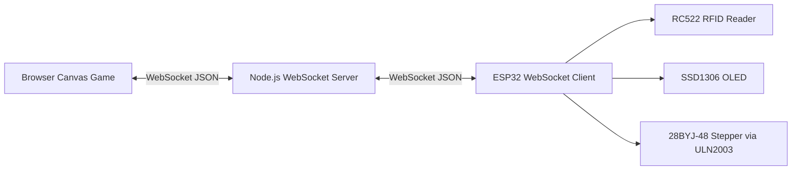

# ESP32 FreeRTOS Reaction Game

A cyber-physical reaction game combining an ESP32 FreeRTOS embedded system with a WebSocket-connected browser game. The ESP32 concurrently manages RFID input, OLED feedback, stepper-motor control, networking, and game events while player reaction time and success statistics are measured by the PC-side game.


[Watch the short demo video](images/35%20second%20demo.mp4)

## Project Overview

This project connects a physical ESP32 game controller to a browser arcade game. A highlighted target emoji moves inside the browser arena. When the target reaches the bottom boundary, the player has a short reaction window to scan an RFID tag on the RC522 reader. The PC-side server judges the attempt, updates streaks and statistics, and sends result feedback back to the ESP32. The embedded side stays hardware-focused. It detects RFID scans, drives the OLED, runs the stepper motor, maintains the FreeRTOS event architecture, and exchanges messages with the PC over WebSockets. The PC side owns scoring and timing so browser and ESP32 clocks do not need to be compared directly.

## Gameplay

The game is streak-based:

- A successful RFID reaction increments the success streak and resets the failure streak.
- A miss or wrong scan increments the failure streak and resets the success streak.
- Five successful target hits in a row wins the game.
- Five failures in a row ends the game.

The reaction acceptance window is currently `900 ms`:

- `0-200 ms`: `PERFECT`
- `201-500 ms`: `GREAT`
- `501-900 ms`: `GOOD`

All three ratings count as successful hits. A scan outside an active target reaction window counts as `WRONG_SCAN`.

## System Architecture



The Node.js server is the session authority. It opens the reaction window when the browser reports a target impact, timestamps RFID messages when they arrive, judges success or failure, updates score/streak state, and broadcasts the result.

The ESP32 networking task converts incoming WebSocket messages into FreeRTOS game events. It does not directly control hardware.

## Hardware Used

- ESP32 WROOM development board
- RC522 RFID reader over SPI
- SSD1306 128x64 OLED over I2C
- 28BYJ-48 stepper motor
- ULN2003 stepper driver board
- RFID tag/card
- Jumper wires and breadboard or equivalent wiring

## Software Stack

- ESP-IDF v6.1
- FreeRTOS tasks and queues
- Native ESP-IDF SPI, I2C, GPIO, Wi-Fi, event, NVS, and WebSocket APIs
- Node.js
- `ws` WebSocket package
- Browser HTML, CSS, JavaScript, and HTML5 Canvas

No Arduino framework, React, or game engine is used.

## FreeRTOS Architecture

| Task | Responsibility | Priority | Core |
| --- | --- | --- | --- |
| `game_logic_task` | Consumes game events, owns embedded game reactions, routes OLED and stepper commands | 3 | 1 |
| `rfid_task` | Polls RC522, reads UIDs, produces `GAME_EVENT_RFID_SCAN` | 2 | 0 |
| `oled_task` | Owns all SSD1306 writes and display states | 2 | 1 |
| `stepper_task` | Owns ULN2003 GPIO writes and motor stepping | 2 | 1 |
| `reaction_network_task` | Owns Wi-Fi/WebSocket connection, incoming parsing, outgoing sends | 2 | 0 |
| `monitor_task` | Periodic health log | 1 | 0 |

FreeRTOS queues keep ownership boundaries clear:

- `game_event_queue`: RFID/network producers to `game_logic_task`
- `oled_state_queue`: `game_logic_task` to `oled_task`
- `stepper_command_queue`: `game_logic_task` to `stepper_task`
- `network_outgoing_queue`: `game_logic_task` to `reaction_network_task`

Tasks block while waiting for work. The stepper task previously risked starving the CPU 1 idle task when a millisecond delay converted to zero scheduler ticks. That was fixed by using a finite `xQueueReceive()` timeout for the step interval and forcing the timeout to at least one FreeRTOS tick.

## Communication Protocol

Messages are simple JSON over WebSockets.

Browser/server to ESP32:

```json
{"type":"GAME_START"}
{"type":"COLLISION","object_id":17}
{"type":"ATTEMPT_SUCCESS","reaction_ms":137,"rating":"PERFECT","score":4}
{"type":"ATTEMPT_FAILED","reason":"MISS"}
{"type":"ATTEMPT_FAILED","reason":"WRONG_SCAN"}
{"type":"GAME_WIN"}
{"type":"GAME_OVER"}
```

ESP32 to server:

```json
{"type":"RFID_SCAN","timestamp_ms":15922}
```

## Repository Structure

```text
.
├── freertos-communication-hub/
│   ├── main/
│   │   ├── freertos-communication-hub.c
│   │   ├── game_events.h
│   │   ├── mfrc522.c / mfrc522.h
│   │   ├── network_config.h
│   │   ├── network_config.example.h
│   │   ├── reaction_network.c / reaction_network.h
│   │   ├── ssd1306.c / ssd1306.h
│   │   └── stepper_motor.c / stepper_motor.h
│   ├── pc-server/
│   │   ├── public/
│   │   │   ├── index.html
│   │   │   ├── style.css
│   │   │   └── game.js
│   │   ├── server.js
│   │   └── package.json
│   ├── CMakeLists.txt
│   ├── dependencies.lock
│   └── sdkconfig
├── images/
└── README.md
```

## Hardware Wiring

### RC522 RFID Reader

| RC522 | ESP32 |
| --- | --- |
| SDA / CS | GPIO 5 |
| SCLK | GPIO 18 |
| MOSI | GPIO 23 |
| MISO | GPIO 19 |
| RST | GPIO 27 |

GPIO 21 and GPIO 22 are reserved for I2C OLED.

### SSD1306 OLED

| OLED | ESP32 |
| --- | --- |
| SDA | GPIO 21 |
| SCL | GPIO 22 |
| I2C address | `0x3C` |

### ULN2003 / 28BYJ-48 Stepper

| ULN2003 | ESP32 |
| --- | --- |
| IN1 | GPIO 25 |
| IN2 | GPIO 26 |
| IN3 | GPIO 32 |
| IN4 | GPIO 33 |

The stepper driver uses the standard 8-step half-step sequence.

## Credential Configuration

Do not commit Wi-Fi credentials or private IP addresses.

The tracked file `freertos-communication-hub/main/network_config.h` loads an ignored local override when present:

```c
#if __has_include("network_config.local.h")
#include "network_config.local.h"
#else
#define REACTION_WIFI_SSID "YOUR_WIFI_SSID"
#define REACTION_WIFI_PASSWORD "YOUR_WIFI_PASSWORD"
#define REACTION_WEBSOCKET_URI "ws://YOUR_PC_IP:8080"
#endif
```

Create your local file from the template:

```powershell
cd freertos-communication-hub
copy main\network_config.example.h main\network_config.local.h
```

Then edit `main/network_config.local.h` with your Wi-Fi SSID, Wi-Fi password, and PC WebSocket URI. The local file is ignored by Git.

## ESP-IDF Build And Flash

From an ESP-IDF v6.1 PowerShell environment:

```powershell
cd freertos-communication-hub
idf.py set-target esp32
idf.py build
idf.py flash monitor
```

If using the Espressif PowerShell profile directly:

```powershell
cd freertos-communication-hub
. "C:\Espressif\tools\Microsoft.v6.1.PowerShell_profile.ps1"
idf.py build
```

## Node.js Server

Install dependencies:

```powershell
cd freertos-communication-hub\pc-server
npm install
```

Run the server:

```powershell
npm start
```

Open the browser game:

```text
http://localhost:8080
```

The ESP32 should connect to the PC's LAN address, for example:

```text
ws://YOUR_PC_IP:8080
```

## Engineering Highlights

- FreeRTOS task ownership keeps hardware writes isolated.
- Queue-based messaging avoids direct cross-task hardware control.
- PC-side timing avoids comparing browser and ESP32 clocks.
- WebSocket reconnect handling keeps the ESP32 resilient during PC server restarts.
- The stepper task is watchdog-friendly because it blocks between steps.
- RFID debounce prevents a held card from generating repeated scans.
- The browser game uses `requestAnimationFrame()` for smooth movement without a heavy game engine.

## Future Improvements

- Add browser-side sound effects and animation polish.
- Add persistent match history.
- Add latency diagnostics.
- Add configurable game duration and difficulty.
- Add a packaged enclosure and wiring diagram.
- Add automated tests for server game-state transitions.
